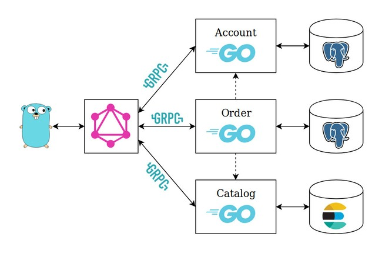

# wpg_pretest

wpg_pretest: Simple E-commerce based on Go microservices, GRPC, protobuf, postgresql, elastic search and GraphQL.

## Overview



## create pb files

```bash
go generate catalog/server.go
go generate account/server.go
go generate order/server.go
```

## create gqlgen generated file [DO NOT DO THIS]

Note: (first make backup of graph folder before doing so or please do not re-generate this again as this will remove all the modifications made to the resolvers inside this folder, you will be bombarded with errors)

```bash
sudo go generate graphql/graph/graph.go
```

## update go.mod and go.sum files

```bash
go mod tidy
```

## Build

install all the dependencies from go.mod into vendor folder

```bash
go mod vendor
docker-compose up -d --build
```

Open <http://localhost:8000/playground> in your browser.
                            or
Try sending Post request for query and mutation to <http://localhost:8000/graphql> in postman.

## Accesing postgres from docker container

```bash
$ docker ps (copy container id where postgres is running)
$ docker exec -it <postgres-container-id-05b3a3471f6f> bash
$root@05b3a3471f6f:/# psql -U <databasename-wpg_pretest>
$ \dt (look for schema name and table name)
$ SELECT * FROM <schema-name>.<table-name>; (Example: SELECT * FROM public.orders;)
$ \q
$ exit
```
